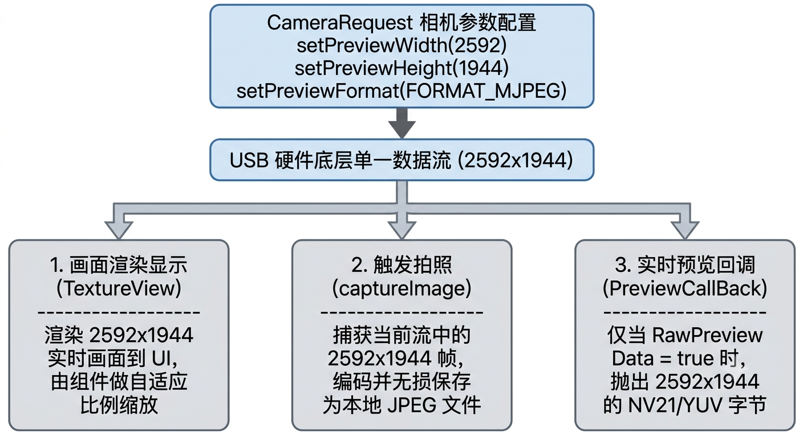
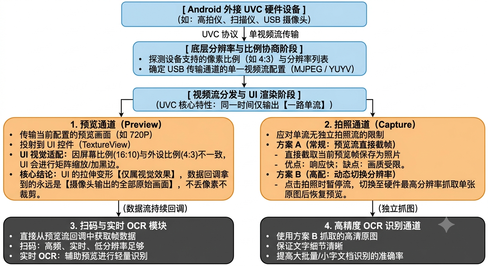
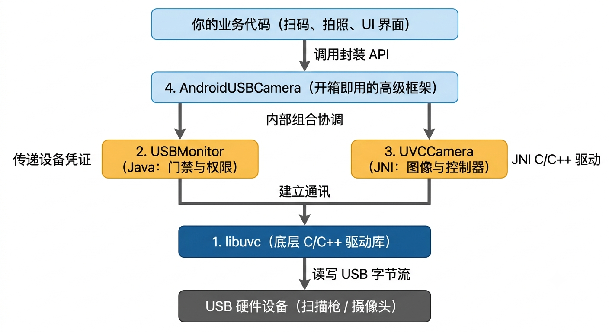
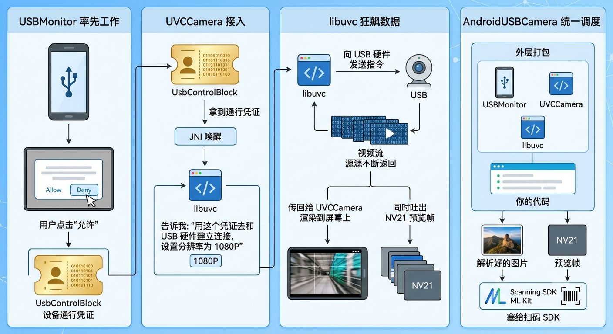
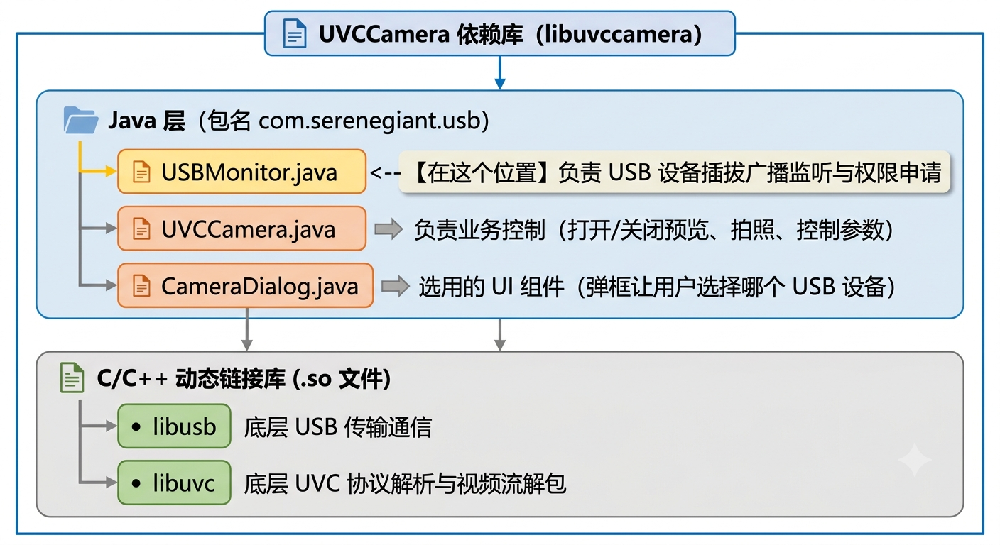

## CameraUse

摄像头应用

## 注解

* @SuppressWarnings("unused")
* @SuppressWarnings("UnusedReturnValue")

## 介绍

## 视频实时渲染预览控件

### AspectRatioTextureView

* 适用
常规相机 / UVC 摄像头预览、界面上有复杂 UI 遮罩 / 弹窗层叠或者预览画面需要跟随手势做旋转、平移、缩放和淡入淡出动画的场景
* 特点
作为普通 View 节点融入 View 树，支持复杂的 View 层叠加与动画特效。

### AspectRatioSurfaceView

* 适用
对性能和功耗要求较高、长时渲染、低延迟的相机实时预览，且不需要对预览 View 本身施加复杂 UI 动画的场景。
* 特点
拥有独立的绘制 Surface，渲染性能最好，功耗低，不占用主线程。

### AspectRatioGLSurfaceView

* 适用
需要对摄像头实时画面做美颜、滤镜、水印、动态贴纸或高级 OpenGLES 图像处理后再渲染展示的场景
* 特点
内置 OpenGL ES 2.0 渲染管线与 OES 纹理加载，方便直接在 GPU 侧使用 Shader 操作纹理数据。

## 媒体结果展示控件

### PreviewImageView

* 适用
拍摄完成 (拍照或停止录像) 后，在界面角落展示刚生成的照片或视频封面缩略图。
* 特点
继承自 ImageView，支持圆角裁剪、内置加载假进度边框环 (drawBorderProgress) 和生成完毕时的呼吸缩放动画 (showBreathAnimation)。 

## 交互控制与 UI 提示控件

### CaptureMediaView

* 适用
相机界面底部的通用拍摄 / 录制大圆按钮
* 特点
支持拍照模式 (圆环放缩)、录像 / 录音模式 (绘制暂停 / 停止图标及外圈环形录制进度条)，并提供点击回调。

### CircleProgressView

* 适用
带进度环的自定义控制按钮 (例如：拍照 / 录制控制、或文件上传 / 处理进度的点击触发按钮)
* 特点
可显示百分比数字文本 (drawTextTip)、弧形进度 (drawProgressArc) 以及点击反馈状态

### TipView

* 适用
拍摄或录制过程中的轻量级浮动文本提示框 (如提示 “画面模糊”、“录制超时”、“请保持手部稳定” 等)
* 特点
继承自 TextView，内置淡入显示与自动延时淡出隐藏的动画逻辑。

## 切换分辨率本质

1. 停止当前视频流
2. 释放当前帧缓冲区 (Frame Buffer)
3. 重新协商 USB Endpoint 带宽
4. 重新分配新的帧缓冲区
5. 开启新视频流

### 开始直设 3840 x 2160 正常

因为初始化阶段是从零分配 4K Buffer 且格式正确锁死为 MJPEG

### 热切换 (2592 x 1944 -> 3840 x 2160) 导致关闭

因旧 Buffer 没释干净、带宽重新协商失败或格式退化为 YUYV
导致 Native 层报错强制触发 closeCamera() 从而相机关闭